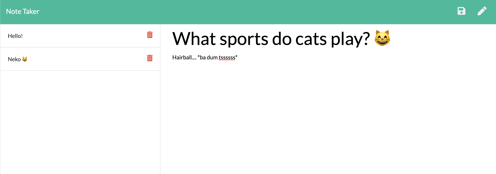

# Note-Taker

## Description

An application that can be used to write, save, and delete notes. This application will uses express backend and save and retrieve note data from a JSON file.

## Installing

Clone the repository to your local development environment.

```
git clone git@github.com:ctinengyn/Note-Taker.git
```

Navigate to the developer-profile-generator folder using the command prompt.

Run `npm install` to install all dependencies. To use the application locally, run `node server.js` in your CLI, and then open `http://localhost:1996` in your preferred browswer. The Note Taker app is [live on Heroku](https://warm-falls-19627.herokuapp.com/notes) for you to use as well.

## Deployed Link:
[Note Taker App](https://whispering-woodland-84908.herokuapp.com/)

[](https://note-taker-supreme.herokuapp.com/)

## Example
The Note-Taker file is created in the dist directory and can be found here:

https://drive.google.com/file/d/15TvyeWOaGdKig2UBmP_IuJ12aSgxjS9z/view 🎥

A screenshot showing an example user input is shown below:


## Built With
* [JavaScript](https://developer.mozilla.org/en-US/docs/Web/JavaScript)
* [NodeJS](https://nodejs.org/)
* Node Packages:
    * [Express](https://www.npmjs.com/package/express)

## Contact

**Email:**
ctine.ngyn@gmail.com

**GitHub:**
[Christine's GitHub](https://github.com/ctinengyn)